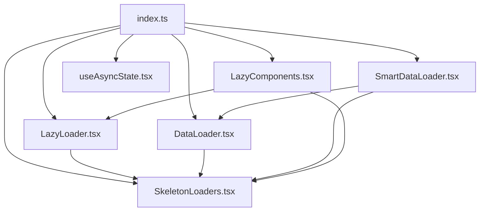

# Loading System Documentation

A comprehensive, reusable loading infrastructure for the CompEx application that provides intelligent loading states, lazy loading, and skeleton animations.

## 📁 File Structure Overview

```
/app/ui/loading/
├── README.md                    # This documentation file
├── index.ts                     # Main exports and utility functions
├── LazyLoader.tsx              # Generic lazy loading component wrapper
├── DataLoader.tsx              # Advanced data loading state manager
├── SmartDataLoader.tsx         # Intelligent loading with data change detection
├── SkeletonLoaders.tsx         # Pre-built skeleton components
├── LazyComponents.tsx          # Lazy-loadable component wrappers
└── useAsyncState.tsx           # Hook for async operation management
```

## 🔧 Core Components

### 1. **LazyLoader.tsx** - Component Lazy Loading
**Purpose**: Lazy loads React components with error boundaries and fallback UI.

**Key Features**:
- Generic lazy loading wrapper
- Built-in error boundaries
- Customizable fallback components
- Delay support for testing
- TypeScript generic support

**Usage**:
```tsx
<LazyLoader
   loader={() => import('./MyComponent')}
   fallback={<MyComponentSkeleton />}
   loadingMessage="Loading component..."
   errorBoundary={true}
   props={componentProps}
/>
```

**Integration**: Used by `LazyComponents.tsx` to create pre-configured lazy components.

---

### 2. **DataLoader.tsx** - Data State Management
**Purpose**: Manages loading, success, error, and empty states for data fetching operations.

**Key Features**:
- Handles all data loading states
- Smooth animations between states
- Previous data display during updates
- Minimum loading time for UX
- Retry functionality

**Usage**:
```tsx
<DataLoader
   status={queryStatus}
   data={queryData}
   error={queryError}
   previousData={previousQueryData}
   loader={<CustomSkeleton />}
   showPreviousData={true}
>
   {(data) => <MyDataComponent data={data} />}
</DataLoader>
```

**Integration**: Base component for data loading, extended by `SmartDataLoader.tsx`.

---

### 3. **SmartDataLoader.tsx** - Intelligent Loading
**Purpose**: Enhanced data loader that prevents unnecessary loading states when data hasn't changed.

**Key Features**:
- Suppresses loading when data exists
- Data change detection via keys
- Prevents UI flickering
- Smart caching behavior
- Optimized for frequent re-renders

**Usage**:
```tsx
<SmartDataLoader
   status={status}
   data={data}
   suppressLoadingWhenDataExists={true}
   dataKey={`${section}-${status}`}
   loader={<Skeleton />}
>
   {(data) => <Component data={data} />}
</SmartDataLoader>
```

**Integration**: Used in main application pages to prevent unnecessary loading states.

---

### 4. **SkeletonLoaders.tsx** - Skeleton Components
**Purpose**: Provides pre-built skeleton loading animations for different UI components.

**Available Skeletons**:
- `TagSectionSkeleton` - For tag/category sections
- `QuestionTableSkeleton` - For data tables
- `CalendarSkeleton` - For calendar widgets
- `ContentSkeleton` - Generic content areas
- `Skeleton` - Base skeleton component

**Usage**:
```tsx
import { TagSectionSkeleton, QuestionTableSkeleton } from '@/app/ui/loading';

<SmartDataLoader loader={<TagSectionSkeleton />}>
   {(data) => <TagSection data={data} />}
</SmartDataLoader>
```

**Integration**: Used as fallback components in all loader types.

---

### 5. **LazyComponents.tsx** - Pre-configured Lazy Components
**Purpose**: Pre-configured lazy-loadable versions of application components.

**Available Components**:
- `LazyCalendar` - Calendar component
- `LazyTagSection` - Tag section component  
- `LazyQuestionTable` - Question table component
- `LazyQuestionWindow` - Question modal window
- `LazyResultWindow` - Result display window

**Utilities**:
- `withLazyLoading()` - HOC for making any component lazy
- `preloadComponent()` - Preload critical components
- `preloadComponents()` - Batch preload multiple components

**Usage**:
```tsx
// Direct usage
<LazyCalendar />

// HOC usage
const LazyMyComponent = withLazyLoading(
   () => import('./MyComponent'),
   <MyComponentSkeleton />
);

// Preloading
useEffect(() => {
   preloadComponents([
      () => import('./CriticalComponent1'),
      () => import('./CriticalComponent2')
   ]);
}, []);
```

**Integration**: Used throughout the application for performance optimization.

---

### 6. **useAsyncState.tsx** - Async State Hook
**Purpose**: React hook for managing async operations with loading states, retry logic, and error handling.

**Features**:
- Built-in retry with exponential backoff
- Minimum loading time support
- Success/error callbacks
- Multiple operation management
- TypeScript generic support

**Usage**:
```tsx
const {
   data,
   status,
   isLoading,
   execute,
   retry,
   reset
} = useAsyncState({
   retryAttempts: 3,
   retryDelay: 1000,
   minLoadingTime: 300
});

// Execute async operation
await execute(() => fetchData());
```

**Integration**: Can be used independently or with other loading components.

---

### 7. **index.ts** - Main Exports
**Purpose**: Central export file for all loading utilities and type definitions.

**Exports**:
- All loading components
- Utility functions
- Type definitions
- Configuration helpers

## 🔄 Component Interactions

### Internal File Relationships



**Key Relationships**:
- `SmartDataLoader` extends `DataLoader` functionality
- `LazyComponents` uses `LazyLoader` for component wrapping
- All loaders use `SkeletonLoaders` for fallback UI
- `index.ts` provides unified interface to all components

### Integration with Main Application

#### 1. **Problems Page Integration** (`/app/dashboard/problems/page.tsx`)

```tsx
import { SmartDataLoader, TagSectionSkeleton, QuestionTableSkeleton } from '@/app/ui/loading';

function ProblemsPage() {
   const tagData = useGetTags();
   const problemData = usePaginatedProblems();

   return (
      <div>
         {/* Tag Section */}
         <SmartDataLoader
            status={tagData.tagStatus}
            data={tagData.tagData}
            loader={<TagSectionSkeleton />}
            suppressLoadingWhenDataExists={true}
            dataKey={`tags-${tagData.tagStatus}`}
         >
            {(data) => <TagSection tagData={data} />}
         </SmartDataLoader>

         {/* Question Table */}
         <SmartDataLoader
            status={problemData.status}
            data={problemData}
            loader={<QuestionTableSkeleton />}
            suppressLoadingWhenDataExists={true}
            dataKey={`problems-${problemData.status}`}
         >
            {(data) => <QuestionTable queryData={data} />}
         </SmartDataLoader>
      </div>
   );
}
```

**Benefits**:
- ✅ No loading states when data hasn't changed
- ✅ Smooth transitions between states
- ✅ Prevents UI flickering during navigation
- ✅ Maintains loaded content when modals open/close

#### 2. **Question Window Integration** (`/features/question-solving/components/QuestionWindow/questionwindow.tsx`)

```tsx
// Direct import (not lazy loaded to prevent double loading)
import QuestionAttempt from '@/features/question-solving/components/QuestionWindow/questionwindow';

function ProblemsPage() {
   return (
      <div>
         {/* Question window loads immediately */}
         {isQuestionWindowOpen && (
            <QuestionAttempt onClose={handleClose} />
         )}
      </div>
   );
}
```

**Optimization Applied**:
- ❌ Removed component lazy loading (caused double loading)
- ✅ Kept only data loading optimizations
- ✅ Immediate component rendering
- ✅ Smart data caching and loading

#### 3. **Component Preloading Strategy**

```tsx
function App() {
   useEffect(() => {
      // Preload non-critical components
      preloadComponents([
         () => import('./ResultWindow'),
         () => import('./Calendar')
      ]);
   }, []);
}
```

## 🚀 Performance Optimizations

### 1. **Smart Loading Logic**
- Only shows loading when data is actually changing
- Suppresses unnecessary loading states
- Maintains UI stability during navigation

### 2. **Efficient Data Comparison**
- Shallow comparison for objects and arrays
- Avoids expensive JSON.stringify operations
- Uses data keys for change detection

### 3. **Component Memoization**
- React.memo for preventing re-renders
- useCallback for stable references
- Optimized dependency arrays

### 4. **Lazy Loading Strategy**
- Component-level lazy loading for large components
- Preloading for critical paths
- Error boundaries for graceful failures

## 🎯 Best Practices

### When to Use Each Component

| Component | Use Case |
|-----------|----------|
| `SmartDataLoader` | Main application data (tables, lists, etc.) |
| `DataLoader` | Simple data loading without optimization needs |
| `LazyLoader` | Large, non-critical components |
| `LazyComponents` | Pre-built lazy versions of common components |
| `useAsyncState` | Custom async operations with retry logic |

### Configuration Guidelines

```tsx
// For stable data that doesn't change often
<SmartDataLoader
   suppressLoadingWhenDataExists={true}
   dataKey="stable-data"
   // ... other props
/>

// For frequently changing data
<DataLoader
   showPreviousData={true}
   minLoadingTime={300}
   // ... other props
/>
```

### Error Handling

```tsx
<SmartDataLoader
   retryAction={() => refetch()}
   errorComponent={<CustomErrorComponent />}
   // ... other props
/>
```

## 🔧 Extending the System

### Adding New Skeleton Components

```tsx
// In SkeletonLoaders.tsx
export const MyCustomSkeleton = React.memo(() => {
   return (
      <motion.div className="space-y-4">
         {Array.from({ length: 5 }).map((_, index) => (
            <Skeleton key={index} className="h-12 w-full" variant="rounded" />
         ))}
      </motion.div>
   );
});
```

### Creating New Lazy Components

```tsx
// In LazyComponents.tsx
export const LazyMyComponent = (props: MyComponentProps) => (
   <LazyLoader
      loader={() => import("./MyComponent")}
      fallback={<MyComponentSkeleton />}
      loadingMessage="Loading my component..."
      props={props}
   />
);
```

This loading system provides a robust, performant, and maintainable solution for handling all loading states throughout the CompEx application.